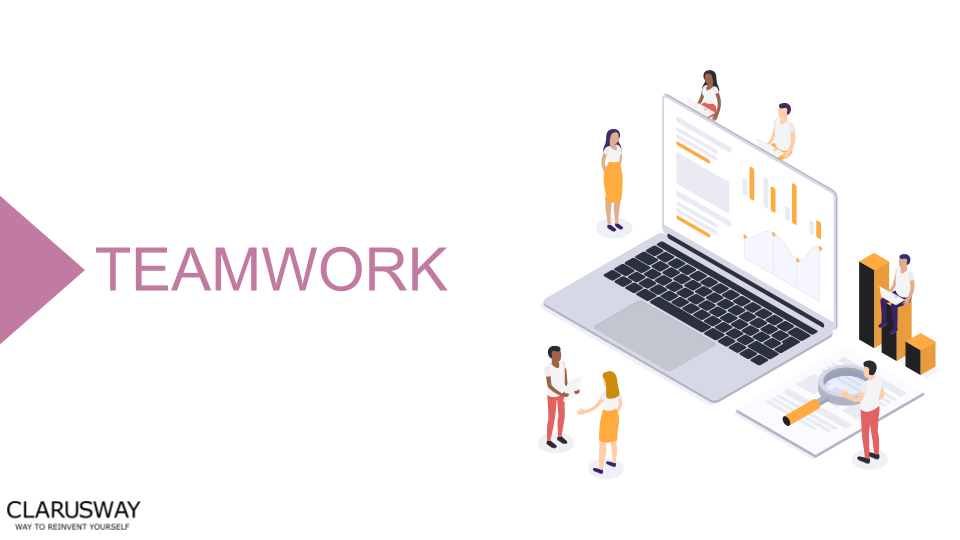

<h1><strong>STUDENT VERSION (Week-10)</strong>

 
 
 
 
 
 

<h1><strong>Meeting Agenda</strong></h1>

▶ Icebreaking 

▶ Questions 

▶ Interview Questions

▶ Coffee Break

▶ Video of the
week

▶ Retro
meeting

▶ Case study /
project

 

<h1><strong>Teamwork Schedule</strong></h1>

<table style= "width:100%;">
                <tr>
                <td style="color: #FA8072; text-align:left "><h3><strong>
Ice-breaking</td>
                <td style="color: #FA8072; text-align:right;"><h3><strong>
10m
<td>                </tr>
</table>

- Introduction.
- Personal Questions (Study Environment, Kids etc.) 
- Any challenges (Classes, Coding, studying, etc.) 
- Ask how they’re studying, give personal advice. 
- Remind that practice makes perfect. 

 
<table style= "width:100%;">
                <tr>
                <td style="color: #FA8072; text-align:left "><h3><strong>
Ask Questions</td>
                <td style="color: #FA8072; text-align:right;"><h3><strong>
30m
<td>                </tr>
</table>
                    
Please solve questions that given below:

- [Pandas 75 exercises with solutions ](https://www.kaggle.com/code/tangchengshun/pandas-75-exercises-with-solutions)
                    
- [PANDAS 6.Exercise: Renaming and Combining](https://www.kaggle.com/code/opkaggle123/pandas-6-exercise-renaming-and-combining)
   
 
                    
 
<table style= "width:100%;">
                <tr>
                <td style="color: #FA8072; text-align:left "><h3><strong>
Interview Questions</td>
                <td style="color: #FA8072; text-align:right;"><h3><strong>
30m
<td>                </tr>
</table>

1- **How do I combine two DataFrames in pandas?**

2- **What is difference between joining and merging in pandas DataFrame?**

<table style= "width:100%;">
                <tr>
                <td style="color: #FA8072; text-align:left "><h3><strong>
ADDITIONAL RESOURCES</td>
                </tr>
</table>

1- [Pandas-Project-Exercise  by using "hotel_booking_data.csv" file](https://github.com/clarusway/DS-1322-EU-DA-Module-Students/blob/main/2-%20Weekly%20Agendas/Week%2010/Pandas-Project-Exercise%20.ipynb)

  Note : This notebook is taken from Jose Portilla Udemy course.

 
                
 

 :coffee: 
<table style= "width:100%;">
                <tr>
                <td style="color: #FA8072; text-align:left "><h3><strong>
Coffee Break</td>
                <td style="color: #FA8072; text-align:right;"><h3><strong>
10m
<td>                </tr>
</table>

:coffee:

 
</table>
 

 
<table style= "width:100%;">
                <tr>
                <td style="color: #FA8072; text-align:left "><h3><strong>
Video of the Week</td>
                <td style="color: #FA8072; text-align:right;"><h3><strong>

<td>                </tr>
</table>

- [How to combine DataFrames in Pandas | Merge, Join, Concat, and Append](https://www.youtube.com/watch?v=wzN1UyfRSWI)

 

<table style= "width:97%;">
                <tr>
                <td style="color: #FA8072; text-align:left "><h3><strong>
Retro Meeting on a personal and team level</td>
                <td style="color: #FA8072; text-align:right;"><h3><strong>
10m
<td>                </tr>
</table>

Ask the questions below:

- What went well? 
- What could be improved? 
- What will we commit to do better in the next week? 

 

<table style= "width:105%;">
                <tr>
                <td style="color: #FA8072; text-align:left "><h3><strong>
Closing</td>
                <td style="color: #FA8072; text-align:right;"><h3><strong>
5m
<td>                   </tr>
</table>

- Next week’s plan

- QA Session 

